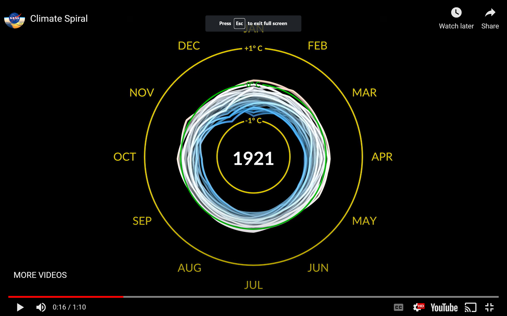
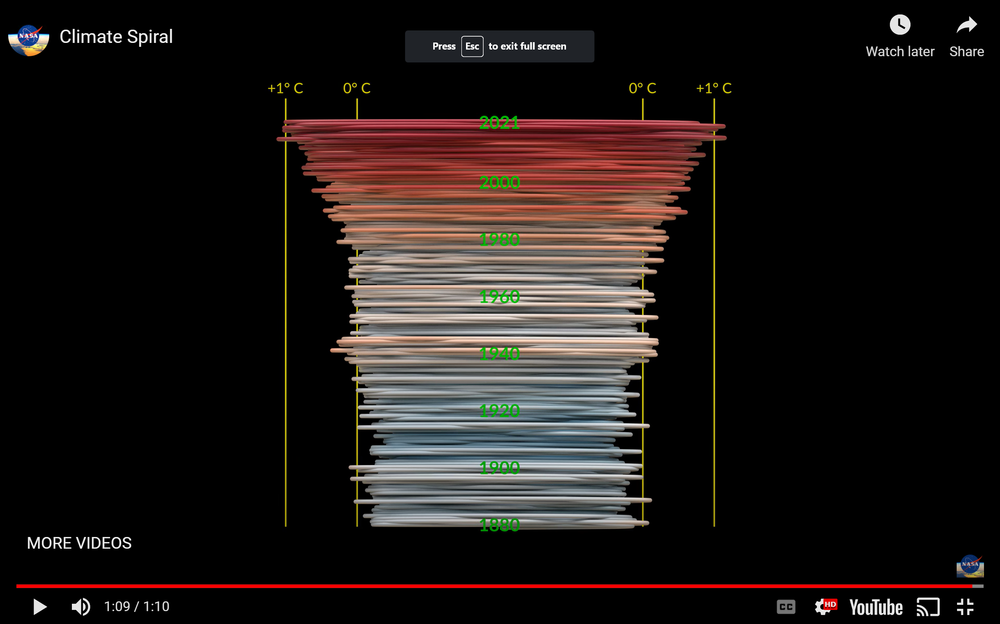
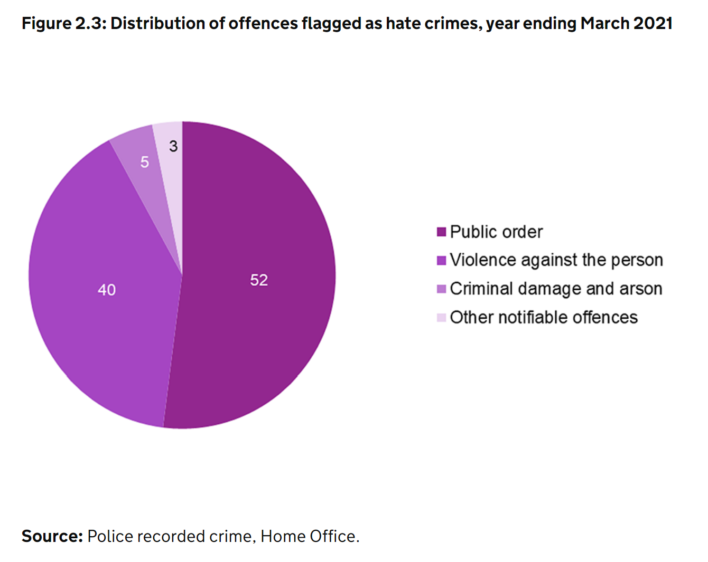

```{r setup, include=FALSE}
knitr::opts_chunk$set(echo = TRUE)

forest <- readr::read_csv('https://raw.githubusercontent.com/rfordatascience/tidytuesday/master/data/2021/2021-04-06/forest.csv')
forest_area <- readr::read_csv('https://raw.githubusercontent.com/rfordatascience/tidytuesday/master/data/2021/2021-04-06/forest_area.csv')
brazil_loss <- readr::read_csv('https://raw.githubusercontent.com/rfordatascience/tidytuesday/master/data/2021/2021-04-06/brazil_loss.csv')
soybean_use <- readr::read_csv('https://raw.githubusercontent.com/rfordatascience/tidytuesday/master/data/2021/2021-04-06/soybean_use.csv')
vegetable_oil <- readr::read_csv('https://raw.githubusercontent.com/rfordatascience/tidytuesday/master/data/2021/2021-04-06/vegetable_oil.csv')

# Installing packages

if(!require("ggplot2")) install.packages("ggplot2")
if(!require("plotly")) install.packages("plotly")
if(!require("hrbrthemes")) install.packages("hrbrthemes")
if(!require("viridis")) install.packages("viridis")
if(!require("ggridges")) install.packages("ggridges")
if(!require("psych")) install.packages("psych")
if(!require("gganimate")) install.packages("gganimate")
if(!require("tidyverse")) install.packages("tidyverse")
if(!require("echarts4r")) install.packages("echarts4r")
if(!require("ggiraph")) install.packages("ggiraph")
if(!require("rgdal")) install.packages("rgdal")
if(!require("RColorBrewer")) install.packages("RColorBrewer")
if(!require("geojsonio")) install.packages("geojsonio")


# Turn off scientific notation globally ####
options(scipen=999)

```

# C7083 Data Visualisation: 

### This document comprises the storytelling, data visualisation and graph critique as required of the Data Visualisation module for the Data Science, Global Agriculture and Environment,  MSc, Harper Adams University. 

Please see the Github for this assignment below

<https://github.com/SConstant/Data-Viz-Deforestation>


##Introduction 

This dataset is taken from the Tidy Tuesday week 15 of 2021, and is centered around Deforestation, delivered via "Forests and Deforestation". Published online at OurWorldInData.org. Retrieved from: 'https://ourworldindata.org/forests-and-deforestation' (Ritchie and Roser, 2021). 
There are four datasets, entitled. forest, forest_use, brazil_loss and soybean_use. 

Forest contains several categorical values, contains the numerical values depicting the changes over four 5 year periods in the number of Hectares classified as forest across different countries as well as continents and grouping which included Least developed countries, Landlocked developing countries, Small island developing states and net food importing developing countries. 


Forest_area contains several categorical values alongside the numerical values depicting the change in global forest share as a percentage across years ranging from 1960-2015.


Brazil_loss contains data which identifies the causes or drivers behind deforestation in Brazil. The dataset includes alongside a column for Brazil, and country code, the year followed by numerous columns identifying a cause and the amount of forest lost in Hectares. 


Soybean_use identifies the production and use of soybeans by country over the years 1961 through 2013. It contains the columns for country and code as categorical variables followed by columns for the year, and three numeric columns depicting the tonnes of soybeans used for human food, animal feed and general processing. 


Vegetable_oil contains data which conveys what crops, and how much in tonnes are used in oil production, over the years 1961 through to 2014.  


```{r world deforestation plot - Data Manipulation, include=FALSE}

# Checking the tibble

forest

summary(forest)

# renaming the net_forest_conversion column header for simplicity

names(forest)[names(forest) == "net_forest_conversion"] <- "conversion"

# Giving each year its own column by using the pivot wider function from tidyr
# This to enable stacking as different groups

forest_wide <- forest %>%
  pivot_wider(names_from = year, values_from = conversion)

forest_wide

# Removing World rows from data frame

forest_countries_wide <- forest_wide %>%
  filter(!entity=='World')

```

## Section One: Deforestation Overview


### Global Net Forest Conversion

```{r World Deforestation Plot, echo=FALSE, warning=FALSE}

# Interactive Plot
# Building a stacked bar plot to show the level of deforestation over the 25 year period

fig_stack <- plot_ly(forest_countries_wide, x = ~entity, y = ~`1990`, type = 'bar', name = '1990', marker = list(color = 'rgb(51,115,255)')) # Building the stack for the 1990 column, selection of bar as the plot type and naming '1990', then selecting the colour using rgb values
fig_stack <- fig_stack %>% add_trace(y = ~`2000`, name = '2000', marker = list(color = 'rgb(255,51,115)')) # Adding the stack for 2000
fig_stack <- fig_stack %>% add_trace(y = ~`2010`, name = '2010', marker = list(color = 'rgb(89,51,255)'))
fig_stack <- fig_stack %>% add_trace(y = ~`2015`, name = '2015', marker = list(color = 'rgb(191,51,255)'))
fig_stack <- fig_stack %>% layout(yaxis = list(title = "Net Forest Conversion (Hectares)"), barmode = 'stack') # Adding a label for the y axis, and selecting the mode to produce a stacked barplot

# Displaying the stacked barplot

fig_stack
```

Fig. 1 Global view of Net Forest conversion over the years 1990, 2000, 2010, 2015.


Above is the data for forest, displayed as an interactive stacked barplot conveying several pieces of information. Firstly providing a quick visual overview of the gains in forest conversion in comparison to the losses over the whole 25 year time period. Looking above the x axis displays the gains and below the losses. Here it can be seen that the losses outweigh the gains in terms of forest conversion over the years. The visualisation also provides a quick overview of how the levels of conversion have differed over the years using colour depicting the years the measurements were taken. The stacking feature shows the total conversion over the entire time period per country. Hovering over the bars yield more detailed information with a country label, exact value of net forest conversion and the year the measurement was taken.


It can be seen from this visualization that Brazil has experienced the greatest negative net conversion of forest, thereby loss of land classified as forest. This is explored further in the following graphs. 

### Contextualising Brazil in the World   

```{r Brazil_World, include=FALSE}

# Data Manipulation for the Base R plot

names(forest)[names(forest) == "net_forest_conversion" ] <- "conversion" # Changing column name for simplicity

brazil_world <- forest %>%
  filter(entity=='World'|entity=="Brazil") # Isolating the rows for world and Brazil and storing these in a new object

brazil_world # Checking the tibble


```

```{r Brazil_world_plot, echo = FALSE}

# Base R Plot

par(mar=c(4,4,4,6)) # Setting the margins for the plot


brazil_forest_bar <- barplot(brazil_world$conversion, border=F, names.arg=brazil_world$entity, # Creating the barplot
                            las=3, # Setting the ticks to be vertical
                            col=c(rgb(0.0,0.8,0.6, 0.6), rgb(0.2,0.2,0.8, 0.6), rgb(0.0,0.6,0.8, 0.6), rgb(0.6,0.6,0.8, 0.6)), # Picking RGB colours
                            main="Net Forest Conversion comparison of Brazil and the World" ) # Adding a title

text(brazil_forest_bar, brazil_world$year , paste(brazil_world$year, sep="") ,cex=0.7) # Labelling the bars with the years
```

Fig.2 Comparison of the Net forest conversion in Brazil to that of the rest of the world.


The base R barplot above depicts only the net forest conversion for Brazil and for the World, so contextualising what the net conversion looks like in Brazil in comparison to the rest of the world. 


Again colour has been used to highlight the differences over the years, with a text label to ensure clarity. The x axis being at the top of the visualisation to highlight the loss of forest and the fact that this depicts a negative forest conversion.


For the data displayed for World, overall the situation is bleak in terms of forest loss with the loss in Brazil being a huge contributor in the years 1990 and 2000. However Brazil has seen a dramatic reduction in the negative conversion of forest between the years 2000 and 2010 losing less than 2 million hectares across these years, though it is interesting to note that this is not reflected in the negative net forest conversions for the rest of the world, reducing only slightly in 2010 and returning to 2000 levels un 2015. 


###Decline of Global percentage share of Forest in Brazil

```{r Brazil_map_setup, include=FALSE}

Brazil <- c("Brazil")

forest_brazil <- filter(forest_area, entity %in% Brazil) # Filtering Brazil and storing in a new object

forest_brazil # Checking the object

names(forest_brazil)[names(forest_brazil) == "forest_area"] <- "area" # Changing names of column for simplicity

forest_brazil$hover <- with(forest_brazil, paste("Brazil")) # Adding Brazil to hover

# Specifying options

g <- list(
  scope = 'brazil',
  showframe = F,
  showland = T,
  landcolor = toRGB("grey10")
)

```


```{r Brazil_map, echo=FALSE}

# Interactive Chloropeth map

Brazil_loss_map <- plot_geo(forest_brazil,
                                    locationmode = "bra", # This is calling the map file
                                    frame = ~year) %>%
  add_trace(locations = ~code,
            z = ~area, text = ~hover, 
            zmin = 12,
            zmax = max(forest_brazil$area),
            color = ~area,
            colorscale = 'Viridis')

Brazil_loss_map<- Brazil_loss_map %>% layout(
  title = 'Decline of global percentage share of Forest in Brazil<br>(Hover for breakdown)',
  geo = g)

Brazil_loss_map <- Brazil_loss_map %>% colorbar(title = "% Global Forest share")

Brazil_loss_map

htmlwidgets::saveWidget(Brazil_loss_map, "Brazil_map.html")

```

Fig. 3 An interactive map, with an animated feature depicting the changes in global percentage share of land classified as forest in Brazil.


The map conveys through the use of animation the percentage loss of land classified as forest in Brazil, fading into darkness as the percentage reduces. The use of animation indicates the loss of just under 2% of global forest share over the time period of 30 years from 1990 to 2020 with the option to play through for a quick overview and sense of the loss over the 30 year period. There is the option to use the slider to get a sense of the loss for individual years alongside the hover feature for the exact percentage of the loss in year.


The legend has been truncated to display both the loss as being around two percent of its global share of forest and the granularity of what just under 2% looks like over the time period of 30 years. Though the previous plot Net forest conversion comparison of Brazil and the world only covers a 25 year period it is interesting to consider what just under 2% looks like over a similar time period.


The size of the country in the context of the world map conveys the gravity of the percentage loss of forest in Brazil. It is also possible to zoom into Brazil for focus. 


## Section Two: Potential drivers of Deforestion in Brazil


### Oil Production in Brazil 

```{r Causes_brazil setup, include=FALSE}
# Stacking brazil loss ####

brazil_loss_stacked <- brazil_loss %>% # Creating a new object
  pivot_longer(cols = starts_with(c("commercial_crops", "flooding_due_to_dams",  "natural_disturbances", "pasture", "selective_logging",
                                    "fire", "mining",  "other_infrastructure", "roads", "tree_plantations_including_palm", "small_scale_clearing")), # Stretching out the dataframe
               names_to = "Causes",
               values_to = "Hectare") %>%
  group_by(year) # Defininf new columns for the names, values and deciding to group by year


brazil_loss_stacked

# Changing names for simplicity

names(brazil_loss_stacked)[names(brazil_loss_stacked) == "small_scale_clearing"] <- "Small scale clearing"
names(brazil_loss_stacked)[names(brazil_loss_stacked) == "tree_plantations_including_palm"] <- "Tree plantations including palm"
names(brazil_loss_stacked)[names(brazil_loss_stacked) == "selective_logging"] <- "Selective logging"
names(brazil_loss_stacked)[names(brazil_loss_stacked) == "other_infrastructure"] <- "Other infrastructure"
names(brazil_loss_stacked)[names(brazil_loss_stacked) == "natural_disturbances"] <- "Natural disturbances"
names(brazil_loss_stacked)[names(brazil_loss_stacked) == "flooding_due_to_dams"] <- "Flooding due to dams"
names(brazil_loss_stacked)[names(brazil_loss_stacked) == "commercial_crops"] <- "Commercial crops"

```

```{r oil_brazil, include=FALSE}

Brazil <- c("Brazil")

oil_brazil <- filter(vegetable_oil, entity %in% Brazil) # Filtering Brazil and storing in a new object

names(oil_brazil)[names(oil_brazil) == "crop_oil"] <- "crop" # Changing names of column for simplicity


summary(oil_brazil)

oil_brazil
```

```{r oil_brazil_heat, echo = FALSE, warning=FALSE}

# Creating a heat map

brazil_heat_map <-ggplot(oil_brazil,aes(year, crop, fill=production)) +
geom_tile() + 
scale_fill_viridis(name="Oil production, tonnes",option ="C")

brazil_heat_map

```

Fig. 4 Heatmap conveying the oil production in tonnes arising from different crops over  the years 1961 to 2014


The heatmap displays the different crops, and their use in oil production over the years in Brazil. The greater the production the lighter the colour, and where there is no data available these have been greyed out. The legend having breaks of two million to enable identification of the greater contributor of oil production in Brazil. 


From the visualisation while cottonseed and palm kernel show some mild inclination in approaching the two million in terms of production it can be seen that soybean, exceeding 6 million tonnes is by far and away that which is used the most to produce oil. 


### Causes of Deforestation in Brazil 

```{r causes_brazil plot, echo=FALSE, warning=FALSE}

# Creating a ridge plot

ggplot(brazil_loss_stacked, aes(x = Hectare, y = Causes, fill = Causes )) +
  geom_density_ridges() +
  theme_ridges() + 
  labs(title = 'Causes of deforestation in Brazil') +
  theme(legend.position = "none")

```

Fig. 5 Ridge Plot (Joy Plot) conveying the drivers of deforestation in Brazil


The ridge plot adds to the detail of the visualisations in section one, providing an overview of the reason why forest in Brazil have been converted over the 23 year period covering 1990 to 2013. As a series of density plots displayed close for comparison it can be seen that much of the mass of Hectares for the different drivers remain consistent. Tree plantations including palm, roads, other infrastructure, natural disturbances, mining, and flooding due to dams remain consistently and relatively low. Small scale clearing and selective logging while higher in mass, are still relatively consistent. Fire and commercial crops begin to deviate, while relatively experiencing a lower mass, do have instances approaching a million hectares. Through the previous heatmap indicated that soybean could be having an impact on the choices around land use in Brazil, it’s interesting to note that commercial crops as a cause of conversion was only the second highest in terms of density.


Conversion of Hectares for Pasture is by far the greatest contributor to forest conversion in Brazil, with numbers of mass approaching up to 3 million.


## Section 3: Soybean as a driver for deforestation 


### Use of soybean by continent over the years 1961 to 2013

```{r soybean_use_increase, include=FALSE}

# Stacking the data for soybean use

soybean_use_stacked <- soybean_use %>%
  pivot_longer(cols = starts_with(c("human_food", "animal_feed", "processed")),
               names_to = "use",
               values_to = "tonnes") %>%
  group_by(year)
```

```{r contintents, include=FALSE}

# Creating a new object organisign the data by continent

continents <- c("Africa", "Asia","Europe", "Northern America", "Oceania", "South America")

soybean_use_continents_stacked <- filter(soybean_use_stacked, entity %in% continents)

```

``` {r soybean use increase, echo=FALSE}

# Creating an animated bubb;e plot

ggplot(soybean_use_continents_stacked, aes(use, year, size = tonnes, colour = use)) +
  geom_point(alpha = 1.0) +
  scale_size(range = c(2, 12)) +
  facet_wrap(~entity) +
  scale_x_discrete(breaks=c("animal_feed", "human_food", "processed"),
                   labels=c("Animal Feed", "Human Food", "Processed")) +
  ylab("Year") +
  xlab("Soybean use") +
  theme(axis.text.x = element_text(angle = 90)) +
  labs(title = 'Year: {frame}', x = 'Soybean Use', y = 'year') +
  transition_states(year, transition_length = 3, state_length = 1) +
  ease_aes('linear')

#saving as a gif

anim_save("Soybeanuse_animated_bubble_030422.gif")

```

Fig 6 Animated bubble plot, divided by continent for clarity conveying the increase in the use of soybeans for Animal feed, Human food, and generalised processed over the years. 


Returning to a further exploration of soybean use, this data visualisation depicts the increase over the years of the use of soybeans for Animal feed, Human food, and generalised processed through the use of animation, where the bigger the bubble the great the use of soybeans in the particular category. The travel of the bubbles being used to indicate the passage of time, with the different uses being further highlighted by colour. The visualisation has been divided by continent to enable both a global overview and a view as to which continents are the biggest contributors to soybean use across the different categories. 


It can be seen that Oceania has been consistent low over the time period, increasing slightly but never beyond 2 million tonnes. Africa has seen modest increases over the years across all three categories, with Europe and Northern America seeing modest increases and fluctuations in the use of soybean for Animal feed, and the greatest increases in processed. Though these do not exceed 2 million for Europe or 4 million for Northern America. 
Asia has seen the biggest consistent increase over the time period across all categories, approaching 8 million tonnes from the year 2000 onwards for processed, and closer to approaching 2 million for Human food. In comparison to South America which has seen the greatest increase also in processed with 8 million tonnes however has not seen the same increase in use for human food. 
While the journey of this series of data visualisations has been largely focussed on Brazil, from fig 6. 


It would be interesting to extend some focus on identifying the finer detail of deforestation in Asia, and looking at the similarities and difference behind the causes of deforestation across the two continents and perhaps Brazil and a country that experience the most deforestation in Asia. 


## Section Four: Critiques

### Good Data Visualisation


#### Climate Spiral 






Please see the link for the animated video https://youtu.be/jWoCXLuTIkI
The Climate spiral is an animated data visualisation which has been designed by Ed Hawkins of the National Centre for Atmospheric Science, University of Reading. It conveys several pieces of information fluidly, and hypnotically around the changes in global monthly temperature anomalies over a time period spanning from 1880 to 2021. The colder hues in shades from White to blue indicate cooler temperatures whereas the hues ranging from orange to red indicate warmer temperature. It is reasonably colourblind friendly as the shading in the hues would still facilitate understanding, except for the use of green in the axis as a contrast to the blue hues in the spiral.


There is an animated spiralling resolution, in which the direction follows the order of the months, and it can be seen through colour which month experienced cooler of warmer temperatures. With every resolution the year in the centre changes so giving a sense of time both on a monthly scale and annual scale and managing to fit these two senses of time passing together seamlessly. It’s easy even though quite fast to understand the relationship between the temperatures and both the monthly and yearly scales at the same time. The philosophical choice to display this information as a resolution adds to the effect as this aligns with our perception of time passing on a planet that both spins daily and revolves around the sun. 


Moreover there are three very simple axis which depict the temperature in Celsius of 1, 0 and -1 which as well as the colour hues, give further context to the direction of the resolution, further out, larger when closer to 1, and the opposite when closer to -1. Presenting this information with both distance and volume alongside the axis enable people to gain a sense of the change in three unique ways. And by providing these ways of accessing information it both feels very natural to absorb this information and increases the accessibility for those who experience neurodiversity. 


Finally when the last year 2021 is reached, the 3 original axis disappear, and the spiral changes orientation to give a visualisation which is in the spirit of a stacking bar plot. Four ablines appear for clarity indicating the part of the plots which fall above and below 0, and in some instances 1. And the centre of the visualisation is labelled with the decades. This provides another facet in which to understand the magnitude of the temperature change over the entire time period. As well as being an excellent way to convey the data informatively it’s also very engaging, it provides a journey for the viewer to follow, a narrative without words with a strong reveal to conclude the narrative at the end of the animation.


### Bad Data Visualisation


#### Hate Crime, England and Wales, 2020 to 2021



This is  figure 2.3 in a government report Hate Crime, England and Wales, 2020 to 2021 depicting the Distribution of offences flagged as hate crimes in the year ending March 2021. It’s a static pie chart, which is difficult in terms of human perception to relate the size of the parts to the values. While it’s good that the parts are labelled with a value, there’s no indication as to what this value is for, whether percentage or actual number of crimes. As the values themselves don’t quite add up to 100, it could be assumed that its number of crimes, but as it’s quite close to 100, it could also be a percentage with NAs taken out. Either way it is a layer of confusion which detracts from interpreting the data in the graph. The colour scheme used for this graph does not give enough contrast, given that there are no spaces in the graph between parts so it’s more difficult still to try and get a sense of relativity in terms of the size of the parts and the relationship of the values. In terms of the values written in the parts, fours of them are white and the value 3 is black, while this may have been applied as a fault in the colours scheme (the part what too light and white did not read well) visually it gives the value an unfair importance as humans naturally notice what appears out of place, while this can be useful in highlighting important information, as there’s no other indication for the colour change it wouldn’t appear to be the case here. The legend presents as a lost opportunity to explain the units of the values, moreover the lightest colour in the scheme is difficult to see in legend without the benefit of contrast in the rest of the scheme.  


### References

Climate Change: Vital Signs of the Planet. (n.d.). Video: Climate Spiral. [online] Available at: https://climate.nasa.gov/climate_resources/300/video-climate-spiral/.

Anon, (n.d.). Climate spirals | Climate Lab Book. [online] Available at: https://www.climate-lab-book.ac.uk/spirals/.

Home Office (2021). Hate crime, England and Wales, 2020 to 2021. [online] GOV.UK. Available at: https://www.gov.uk/government/statistics/hate-crime-england-and-wales-2020-to-2021/hate-crime-england-and-wales-2020-to-2021.


 Data Visualization. (n.d.). [online] socviz.co. Available at: https://socviz.co/lookatdata.html#lookatdata [Accessed 7 Apr. 2022].

 Wickham (2014) Tidy data. Journal of Statistical Software 59: 1-23.File
Healy (2018) Chapter 3 - How ggplot Works. Data Visualization: A Practical Guide.URL

Journalism, B.V. and D. (2019). How the BBC Visual and Data Journalism team works with graphics in R. [online] BBC Visual and Data Journalism. Available at: https://medium.com/bbc-visual-and-data-journalism/how-the-bbc-visual-and-data-journalism-team-works-with-graphics-in-r-ed0b35693535 [Accessed 7 Apr. 2022].

Wilke, C.O. (n.d.). Fundamentals of Data Visualization. [online] clauswilke.com. Available at: https://clauswilke.com/dataviz/telling-a-story.html [Accessed 7 Apr. 2022].

Analysis | Study: Charts change hearts and minds better than words do. (n.d.). Washington Post. [online] Available at: https://www.washingtonpost.com/news/wonk/wp/2018/06/15/study-charts-change-hearts-and-minds-better-than-words-do/ [Accessed 7 Apr. 2022].

plotly.com. (n.d.). Choropleth. [online] Available at: https://plotly.com/r/choropleth-maps/ [Accessed 7 Apr. 2022].

plotly.com. (n.d.). Bar. [online] Available at: https://plotly.com/r/bar-charts/.

Holtz, Y. (2018). From data to Viz | Find the graphic you need. [online] Data-to-viz.com. Available at: https://www.data-to-viz.com/.
